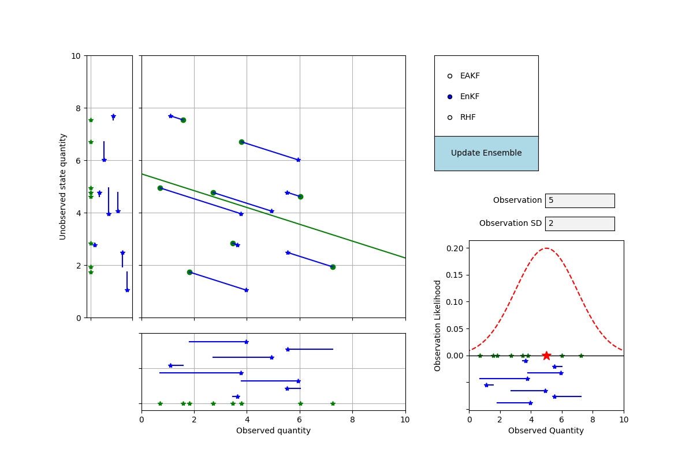
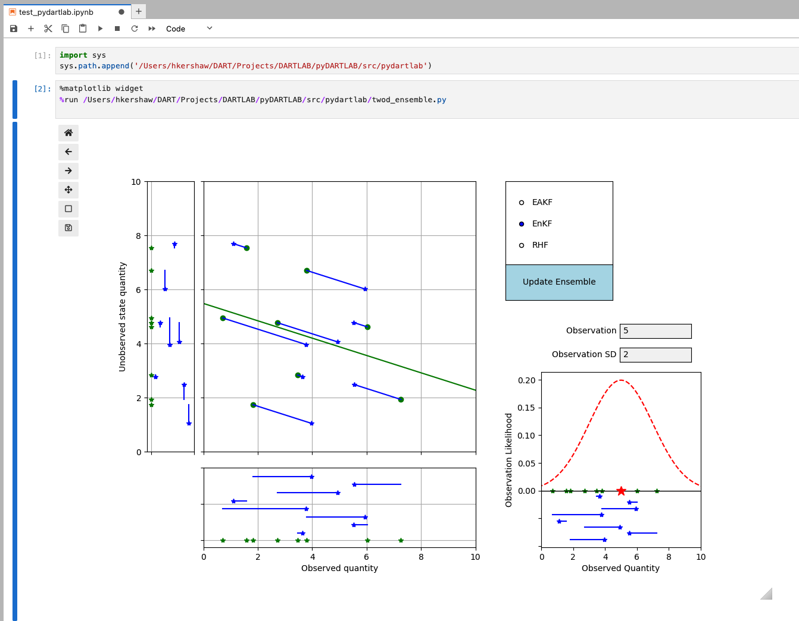

# DartLabPlot

DartLabPlot is a python library designed for creating and managing interactive plots for the DARTLAB tutorial.

## Example usage

## Contributing
Contributions are welcome! If you have a feature request, bug report, or a suggestion, please open an issue on our GitHub repository.

## License

DartLabPlot is released under the Apache License 2.0. For more details, see the LICENSE file in the root directory of this source tree or visit [Apache License 2.0](https://www.apache.org/licenses/LICENSE-2.0).